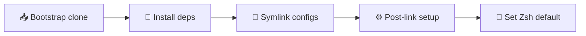

<div align="center">

# 🛠️ .dotfiles

### One command. Any machine. A beautiful shell. ✨

*Cross-platform dotfiles that bootstrap a fresh **macOS** or **Linux** box —
from zero to a fully wired Zsh in a single paste.*

<br />


</div>

---

## 🚀 Quick start

> [!TIP]
> Fresh machine? This is the only command you need. It bootstraps **everything**.

```sh
bash -c "$(curl -fsSL https://raw.githubusercontent.com/jonogould/dotfiles/master/install.sh)"
```

That's it. ☕ The installer clones this repo to `~/.dotfiles` (over HTTPS — **no
SSH keys required**), re-execs itself from there, and is **100% safe to re-run**.

---

## ✨ Highlights

| | |
| --- | --- |
| 🖥️ **Cross-OS** | One installer, identical result on macOS & Linux |
| 🔁 **Idempotent** | Re-run anytime — it heals drift and never clobbers your secrets |
| 🧳 **Auto-backup** | Existing files are stashed in a timestamped folder before linking |
| 🎨 **Gorgeous `.env` wizard** | A polished Go TUI walks you through your secrets |
| 🧬 **Profile provisioning** | Rehydrate private details from one YAML file, zero prompts |
| 🪶 **Featherweight clone** | Git LFS pulls *only* the binary your CPU needs |
| 🍓 **Raspberry-Pi friendly** | No bloated downloads, no Go required at install |

---

## 📦 What `install.sh` does



1. **🥾 Self-bootstrap** — clones the repo to `~/.dotfiles` (or `git pull`s if it
   already exists), then re-runs from the cloned copy.
2. **🧱 Dependencies**
   - 🍎 **macOS** — installs [Homebrew](https://brew.sh) if missing, then
     `brew bundle` from the [`Brewfile`](Brewfile).
   - 🐧 **Linux** — detects `apt-get` / `dnf` / `pacman` and installs
     `git git-lfs zsh go jq grc curl`.
3. **🔗 Symlinks** — links config files into `$HOME`. Any existing real file is
   moved to `~/.dotfiles-backup-<timestamp>/` first, then replaced with a
   symlink (`ln -sfn`).
4. **⚙️ Post-link setup**
   - 🔌 [antidote](https://github.com/mattmc3/antidote) — from Homebrew on macOS
     (it's in the [`Brewfile`](Brewfile)); on Linux without Homebrew it falls
     back to a git clone into `~/.antidote`. Either way it regenerates
     `~/.zsh_plugins.zsh` (from `~/.zsh_plugins.txt`).
   - 📦 [nvm](https://github.com/nvm-sh/nvm) — from Homebrew on macOS (the
     installer just ensures the `~/.nvm` data dir exists); on Linux without
     Homebrew it falls back to the upstream install script into `~/.nvm`.
   - 🔐 **`.env` wizard** — see [Secrets](#-secrets--env) below.
   - ⚡ Recompiles zsh files via [`zsh/compile.zsh`](zsh/compile.zsh).
   - 🐚 Sets Zsh as the default shell (only if it's listed in `/etc/shells`).

---

## 🗺️ Symlink map

| 📄 Source (in repo)           | 🎯 Target         |
| ----------------------------- | ----------------- |
| `zsh/zshrc`                   | `~/.zshrc`        |
| `git/gitconfig`               | `~/.gitconfig`    |
| `editorconfig/editorconfig`   | `~/.editorconfig` |
| `ack/ackrc`                   | `~/.ackrc`        |

---

## 🔐 Secrets / `.env`

API keys for AI tooling are sourced by [`zsh/ai.zsh`](zsh/ai.zsh) from
`~/.dotfiles/.env` — which is **🙈 gitignored and never committed.**

When run interactively, the installer launches a prebuilt **Go TUI**
([`scripts/envsetup`](scripts/envsetup)) that walks you through each variable:

- ⌨️ Pre-fills the existing/template value — just hit **Enter** to keep it.
- 🕶️ **Masks** secret-looking keys (`*TOKEN*`, `*KEY*`, `*SECRET*`, …) as you type.
- 💾 Writes `.env` **atomically** with `0600` perms.
- 🪄 Works even under `curl | bash` because it reads from `/dev/tty`.

> [!NOTE]
> When run non-interactively (CI / no tty), if you decline the prompt, or if
> git-lfs / the matching binary is unavailable, it gracefully falls back to
> copying the template **only if `.env` is missing** — so you can fill it in by hand:

```sh
cp ~/.dotfiles/.env.example ~/.dotfiles/.env
$EDITOR ~/.dotfiles/.env
```

🔑 Keys: `GOCODE_API_TOKEN` · `OPENAI_API_KEY`

---

## 🧬 Reviving private details (profiles)

Personal & employer-specific details are kept **out of version control** —
your Git identity, private endpoints, secrets, `GOPRIVATE` orgs, work aliases
and tool shims live in **gitignored local files** (`git/identity.local`,
`.env`, `zsh/local.zsh`). To rehydrate them on a fresh machine in one shot,
keep a single **private YAML profile** (in a password manager / secure note)
and point the installer at it:

```sh
DOTFILES_PROFILE=~/secure/dotfiles.profile.yml \
  bash -c "$(curl -fsSL https://raw.githubusercontent.com/jonogould/dotfiles/master/install.sh)"
```

When `DOTFILES_PROFILE` is set, the installer provisions **non-interactively**
(the `.env` wizard is skipped) by regenerating each local file from the
profile. See [`dotfiles.profile.example`](dotfiles.profile.example) for the
full schema:

```yaml
git:                       # -> git/identity.local
  name: Your Name
  email: you@example.com
env:                       # -> .env (overlaid onto .env.example, 0600)
  ANTHROPIC_BASE_URL: ""
  GOCODE_API_TOKEN: ""
zsh:                       # -> zsh/local.zsh
  GOPRIVATE: "github.com/your-org/*"
  extra: |
    alias work="cd ~/dev/work"
```

- 🔑 The profile is the **source of truth** — sections it provides are
  (re)written; sections it omits are left untouched.
- 🪞 `.env` keeps the template's order and references (e.g. `OPENAI_API_KEY`
  mirrors `GOCODE_API_TOKEN`); extra keys are appended.
- 🛡️ Real profiles are **gitignored** (`dotfiles.profile*`) — only the
  `.example` template is tracked.

> [!IMPORTANT]
> Profile mode reuses the prebuilt LFS helper, so it needs `git-lfs` and the
> matching binary. If either is missing it warns and falls back to the
> interactive flow.

---

## 🎨 The `.env` wizard (`scripts/envsetup`)

The interactive wizard is a tiny, dependency-light Go program.

Prebuilt binaries for `darwin` / `linux` × `amd64` / `arm64` live under
[`scripts/envsetup/bin/`](scripts/envsetup/bin) and are tracked with **Git LFS**:

- 🪶 A fresh clone / bootstrap uses `GIT_LFS_SKIP_SMUDGE=1` and pulls only LFS
  pointers (a few **KB**).
- 🎯 The installer then `git lfs pull --include`s **just the one binary** for the
  current host — a Raspberry Pi never downloads the other platforms' builds.

### 🔧 Rebuilding (maintainers)

Built with the pinned Go toolchain `go1.25.11` (auto-downloaded via the
`toolchain` directive). After editing `scripts/envsetup/main.go` or its deps:

```sh
./scripts/envsetup/build.sh   # 🏗️  cross-compiles all four targets into bin/
git add scripts/envsetup/bin  # 📦  LFS-tracked via .gitattributes
git commit
```

> [!IMPORTANT]
> Contributors need Git LFS installed once: `git lfs install`.

---

## 🔄 Re-running / updating

The installer is **idempotent** — re-running pulls the latest repo, re-links
anything that drifted (backing up first), and re-runs post-link setup **without
clobbering your `.env`.** To update later:

```sh
bash ~/.dotfiles/install.sh
```

---

## ⚡ Zsh recompile

`.zwc` files are compiled bytecode that speed up shell startup. They're
gitignored and regenerated automatically during install. After editing any
`.zsh` file, recompile:

```sh
zsh ~/.dotfiles/zsh/compile.zsh
```

---

## 📜 License

Released into the **public domain** under [The Unlicense](LICENSE) — copy,
modify, use, and redistribute it however you like, no attribution required.

---

<div align="center">

**Built with 🐚 Zsh, 🐹 Go, and a lot of ☕.**

</div>
